# Abstract Data Type (ADT)

## Table of Contents

- [What an ADT defines](#what-an-adt-defines)
- [What an ADT ignores](#what-an-adt-ignores)
- [Example](#example)
- [JavaScript Language-Defined Data Structures](#javascript-language-defined-data-structures)
  - [Array](#array)
    - [Array ADT Operations](#array-adt-operations)
    - [Applications of Arrays](#applications-of-arrays)
  - [Linked List](#linked-list)
    - [Key Characteristics](#key-characteristics)
    - [Types of Linked Lists](#types-of-linked-lists)
    - [Linked List ADT Operations](#linked-list-adt-operations)
  - [Stack](#stack)
    - [Stack ADT Operations](#stack-adt-operations)
  - [Queue](#queue)
    - [Queue ADT Operations](#queue-adt-operations)
  - [Tree](#tree)
    - [Binary Tree](#binary-tree)
    - [Binary Search Tree (BST)](#binary-search-tree-bst)
    - [BST ADT Operations](#bst-adt-operations)
  - [Heap / Priority Queue](#heap--priority-queue)
    - [Max Heap](#max-heap)
    - [Min Heap](#min-heap)
    - [Heap ADT Operations](#heap-adt-operations)
  - [Hash Table](#hash-table)
    - [Storing Data](#storing-data)
    - [Searching Data](#searching-data)
    - [Hash Table ADT Operations](#hash-table-adt-operations)
    - [Dictionary](#dictionary)
    - [Set](#set)
- [Endnote](#endnote)

---

An **Abstract Data Type (ADT)** is a high-level model that defines a type of data purely by its behavior — the values it can represent and the operations it exposes — without dictating how that behavior is implemented underneath.

Think of it as a **contract between the user and the data**: the user knows what they can do with the data, but not how the data handles it internally.

## What an ADT defines

- **Values** — what kind of data can be stored
- **Operations** — what actions the user can perform on that data

## What an ADT ignores

- Internal memory layout
- Choice of underlying data structure (array, linked list, tree, etc.)
- Any implementation-specific detail

## Example

Suppose you need a structure that holds a collection of integers and can report their average. The ADT for this would expose just two operations:

| Operation | Description |
|-----------|-------------|
| `add(n)` | Stores an integer in the collection |
| `getMean()` | Returns the average of all stored integers |

Whether the collection is backed by an array or a linked list is irrelevant from the ADT's perspective — that is a decision left to the implementation.

## JavaScript Language-Defined Data Structures

JavaScript ships with built-in, high-quality, high-performance data structures and algorithms ready to use out of the box.

### Advantages

1. **No reinvention of the wheel** — basic data structures are already implemented, freeing developers to focus on business logic.
2. **Reliable quality** — built-in implementations are well-tested and optimized, raising the overall quality of programs that use them.
3. **Lower development cost** — common data structures and algorithms don't need to be written from scratch.
4. **Readability** — code is easier to review and understand since most JavaScript developers are familiar with these structures, which are also well documented.

### Array

The simplest JavaScript built-in data structure. Stores a collection of items, traditionally of the same data type, in a sequential order.

#### Array ADT Operations

| Operation | Description | Time Complexity |
|-----------|-------------|-----------------|
| `arr[k] = value` | Write a value at position `k` | O(1) |
| `arr[k]` | Read the value at position `k` | O(1) |
| `arr[k] = newValue` | Replace the value at position `k` | O(1) |

All core array operations run in **O(1) constant time** — no matter the size of the array, accessing or writing to a known index takes the same amount of time.

#### Applications of Arrays

1. **Tabular data** — storing structured data in rows and columns.
2. **Matrices** — representing grids, e.g. seat maps in online ticket booking systems.
3. **Higher-level data structures** — arrays serve as the underlying foundation for Stacks, Queues, Heaps, Hash Tables, and more.

### Linked List

A **linked list** is a dynamic data structure where memory is allocated at runtime. Unlike arrays, elements are **not stored contiguously** in memory — instead, each element (node) holds a value and a pointer to the next node in the sequence.

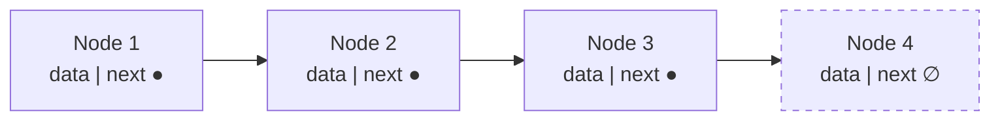

#### Key Characteristics

| Characteristic | Detail |
|----------------|--------|
| Memory allocation | Dynamic — at runtime |
| Storage layout | Non-contiguous |
| Element access | Sequential — no direct index access |
| Performance vs Array | Slower access, but flexible size |
| Best used when | Number of elements is unknown ahead of time |

#### Types of Linked Lists

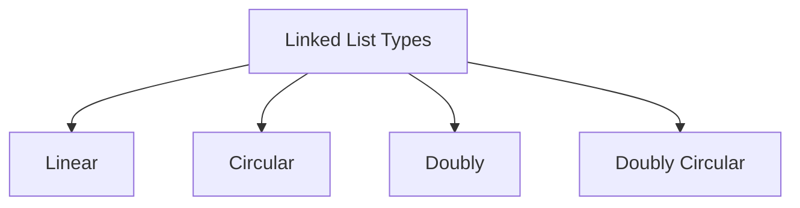

#### Linked List ADT Operations

| Operation | Description | Time Complexity |
|-----------|-------------|-----------------|
| `Insert(k)` | Creates a new node and places it at the start of the list by moving pointers | O(1) |
| `Delete()` | Removes the first node by moving one pointer | O(1) |
| `Print()` | Traverses the list from head to tail, displaying each element | O(N) |
| `Find(k)` | Traverses the list until it finds the node with value `k` or reaches the end | O(N) |
| `IsEmpty()` | Checks if the head pointer is `null` — if so, the list is empty | O(1) |

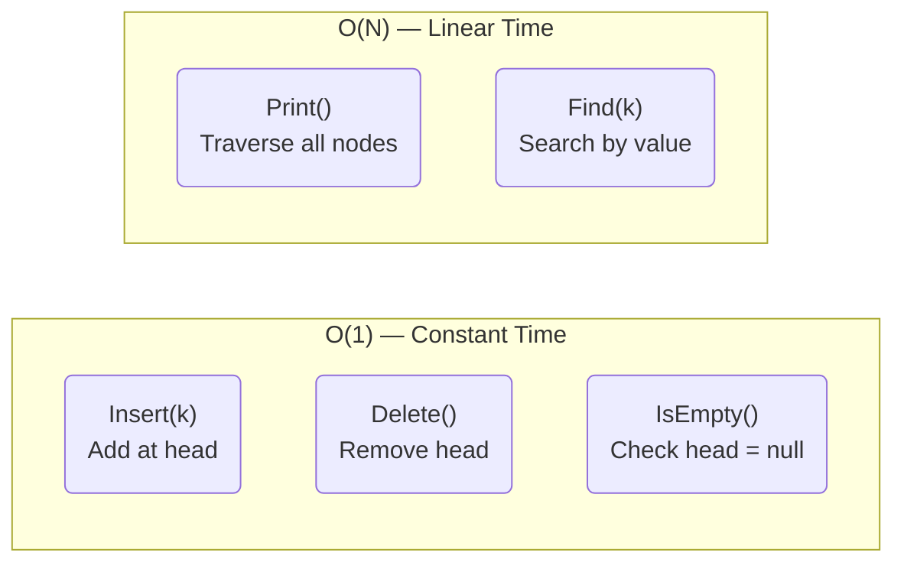

### Stack

A **Stack** is a data structure that follows the **Last-In, First-Out (LIFO)** principle — the last element added is the first one to be removed.

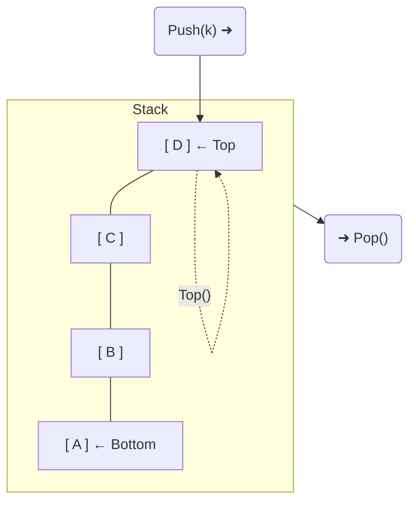

#### Stack ADT Operations

| Operation | Description | Time Complexity |
|-----------|-------------|-----------------|
| `Push(k)` | Adds value `k` on top of the stack | O(1) |
| `Pop()` | Removes and returns the top element | O(1) |
| `Top()` | Returns the value of the top element without removing it | O(1) |
| `Size()` | Returns the number of elements in the stack | O(1) |
| `IsEmpty()` | Returns `1` if the stack is empty, `0` otherwise | O(1) |

> All Stack operations run in **O(1) constant time**.

### Queue

A **Queue** is a data structure that follows the **First-In, First-Out (FIFO)** principle — the first element added is the first one to be removed.

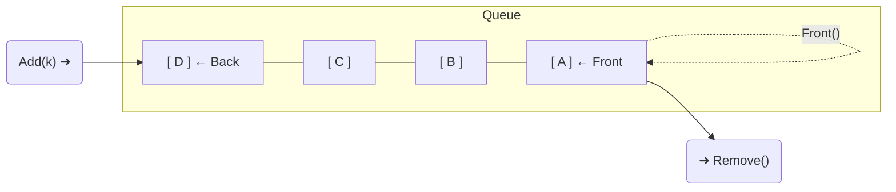

#### Queue ADT Operations

| Operation | Description | Time Complexity |
|-----------|-------------|-----------------|
| `Add(k)` | Inserts element `k` at the back of the queue | O(1) |
| `Remove()` | Removes and returns the element at the front | O(1) |
| `Front()` | Returns the value at the front without removing it | O(1) |
| `Size()` | Returns the number of elements in the queue | O(1) |
| `IsEmpty()` | Returns `1` if the queue is empty, `0` otherwise | O(1) |

> All Queue operations run in **O(1) constant time**.

### Tree

A **Tree** is a hierarchical data structure where each element is called a **node**. Key terminology:

- **Root** — the top node with no parent
- **Parent / Child** — each node (except root) has one parent and zero or more children
- **Leaf** — a node with no children (last level)

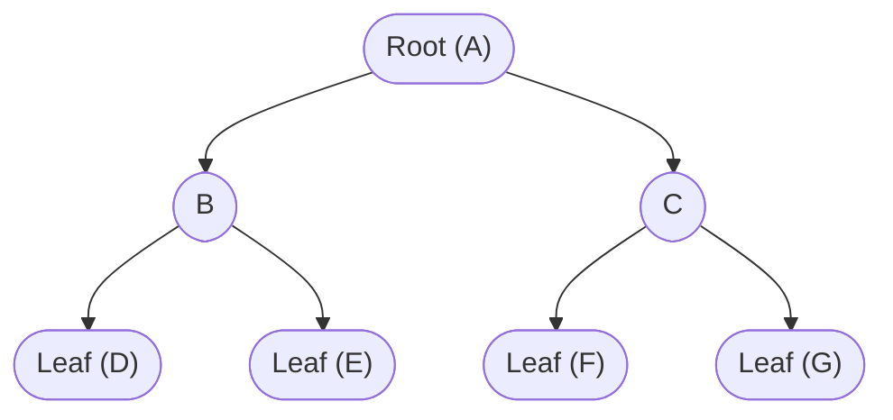

> Trees are the most appropriate data structure for storing **hierarchical records**.

#### Binary Tree

A **Binary Tree** is a tree where each node has **at most two children**: a **left child** and a **right child** (0, 1, or 2).

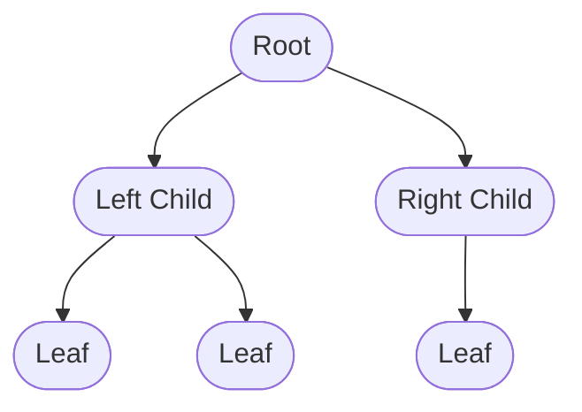

#### Binary Search Tree (BST)

A **Binary Search Tree** is a binary tree where nodes are ordered by a rule:

- Left subtree keys are **≤** the parent node key
- Right subtree keys are **>** the parent node key

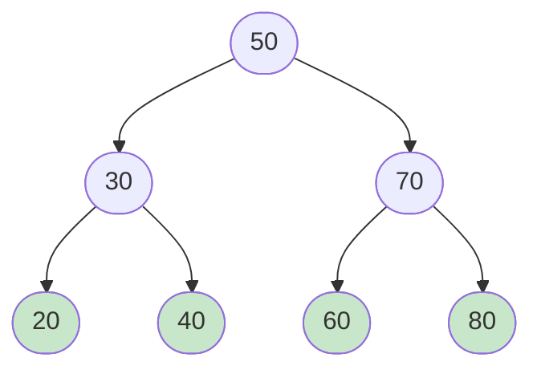

> Left ≤ Parent < Right — this ordering makes search efficient.

#### BST ADT Operations

| Operation | Description |
|-----------|-------------|
| `Insert(k)` | Inserts element `k` into the correct position in the tree |
| `Delete(k)` | Removes element `k` from the tree |
| `Search(k)` | Checks whether value `k` exists in the tree |

### Heap / Priority Queue

A **Heap** is a data structure used to implement a **Priority Queue**. Data is logically organised as a **complete binary tree** — a binary tree filled at all levels except possibly the last.

The key property: each parent node's value is **greater or smaller** than its children's values, depending on the heap type.

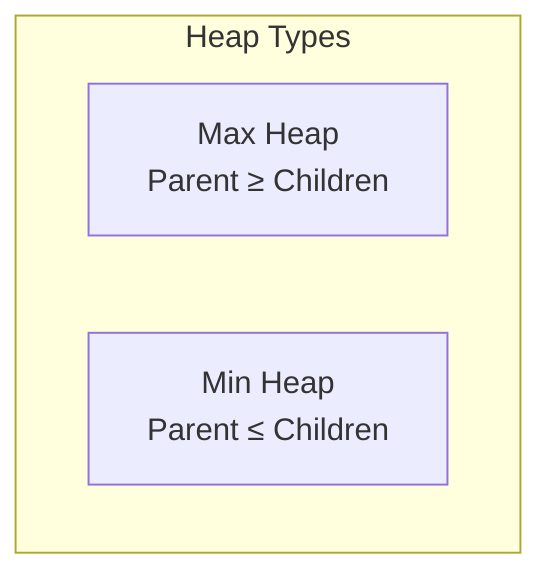

#### Max Heap

Every parent node has a value **greater than or equal to** its children. The **largest** value is always at the root.

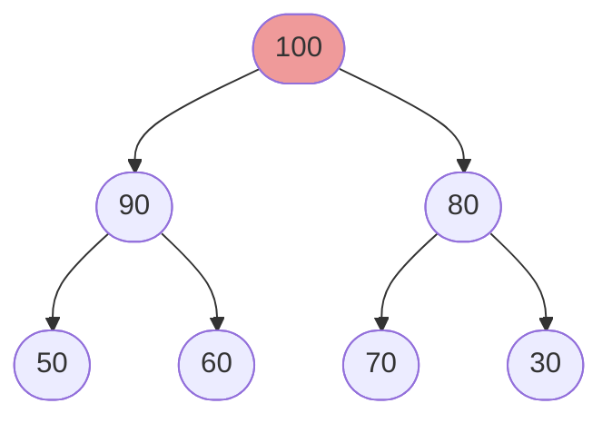

> Root = maximum value

#### Min Heap

Every parent node has a value **less than or equal to** its children. The **smallest** value is always at the root.

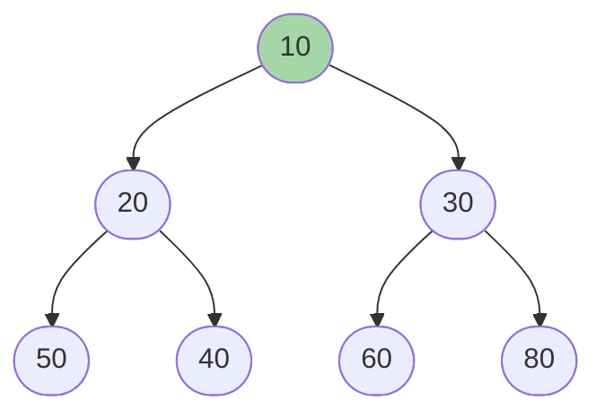

> Root = minimum value

#### Heap ADT Operations

| Operation | Description | Time Complexity |
|-----------|-------------|-----------------|
| `Insert(k)` | Adds a new element `k` to the heap | O(log n) |
| `Remove()` | Extracts the max (Max Heap) or min (Min Heap) from the root | O(log n) |
| `Heapify()` | Converts an array of numbers into a valid heap | O(n) |

> **Note:** Full Heap implementation is covered in the Heap chapter.

### Hash Table

A **Hash Table** maps keys to values using a **hash function** to calculate the index where data is stored in an array. It is most efficient when the number of stored key-value pairs is small relative to the total number of possible keys.

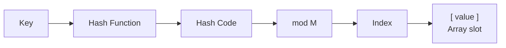

#### Storing Data

1. Create an array of size `M` — the Hash Table
2. Compute the hash code of the key using a hash function
3. Calculate `index = hashCode % M`
4. Store the value at that index

#### Searching Data

1. Compute the hash code for the search key
2. Calculate `index = hashCode % M`
3. Retrieve the value at that index

#### Hash Table ADT Operations

| Operation | Description | Time Complexity (avg) |
|-----------|-------------|----------------------|
| `Insert(x)` | Adds `x` to the hash table | O(1) |
| `Delete(x)` | Removes `x` from the hash table | O(1) |
| `Search(x)` | Looks up `x` in the hash table | O(1) |

> The average time to search for an element in a Hash Table is **O(1)**.

#### Dictionary

A **Dictionary** maps keys to values using a hash table internally. Keys are unique; values may be duplicated. Elements are **not stored in sorted order**.

See [`dictionary.ts`](./dictionary.ts) for full examples using both `{}` and `Map()`.

#### Set

A **Set** stores only **unique elements** and is implemented using a hash table. Elements are **not stored in sequential order**.

See [`set.ts`](./set.ts) for a full example.

## Endnote

This chapter introduced the various data structures and their complexities at a high level. Each of these structures will be studied in detail in subsequent chapters. Knowing the interface of a data structure is enough to use it effectively — the internal implementation is a separate concern.
