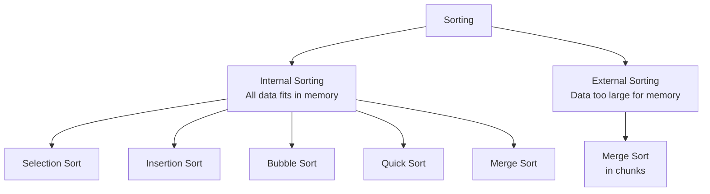
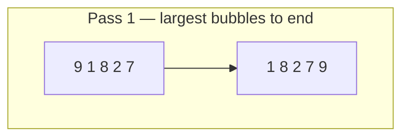

# Sorting

## Table of Contents

- [Introduction](#introduction)
- [Types of Sorting](#types-of-sorting)
- [Comparison Functions](#comparison-functions)
- [Bubble Sort](#bubble-sort)
  - [Analysis](#analysis)
  - [Complexity](#complexity)
  - [Modified Bubble Sort](#modified-bubble-sort)
  - [Modified Complexity](#modified-complexity)

---

## Introduction

**Sorting** is the process of arranging elements in ascending or descending order.

- Sorting makes **searching simpler** by arranging data in a logical order
- Small datasets → simple algorithms (Bubble, Insertion, Selection Sort)
- Large datasets → efficient algorithms (Merge, Quick, Heap Sort)
- Datasets too large for memory → **external sorting** (Merge Sort in chunks)

## Types of Sorting



## Comparison Functions

All sorting algorithms rely on one of two comparison functions to decide whether to swap values:

| Function | Returns `true` when | Sort direction |
|----------|---------------------|----------------|
| `less(a, b)` | `a < b` | Descending |
| `greater(a, b)` | `a > b` | Ascending |

```typescript
const less    = (a: number, b: number): boolean => a < b;
const greater = (a: number, b: number): boolean => a > b;
```

> Using `greater()` → sorted in **increasing** order.
> Using `less()` → sorted in **decreasing** order.

## Bubble Sort

**Bubble Sort** compares each pair of adjacent values and swaps them if they are in the wrong order. The largest value "bubbles" to the end of the array after each pass.



See [`bubble-sort.ts`](./bubble-sort.ts) for the full implementation.

### Analysis

1. **Outer loop** — controls the number of passes (N passes total)
2. **Inner loop** — compares adjacent pairs; after each pass the next-largest value is in place
3. Using `greater()` sorts in **increasing** order; swap to `less()` for **decreasing** order

### Complexity

| Case | Time Complexity |
|------|----------------|
| Worst case | O(n²) |

> Inner loop executes: (n-1) + (n-2) + ... + 1 = **O(n²)**

### Modified Bubble Sort

An improvement: track whether any swap occurred in a pass. If no swap happened, the array is already sorted — stop early.

See [`bubble-sort.ts`](./bubble-sort.ts) for the `bubbleSortImproved` implementation.

### Modified Complexity

| Case | Time Complexity |
|------|----------------|
| Worst case | O(n²) |
| Average case | O(n²) |
| Best case (nearly sorted) | O(n) |
| Space complexity | O(1) |
| Stable sort | Yes |
